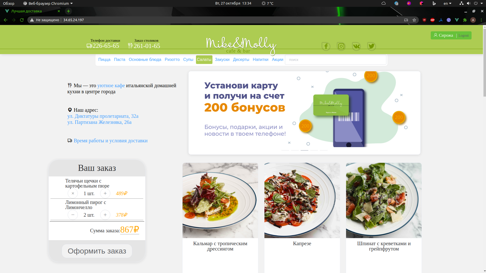

Проект на Django и Vue, для курсовой работы.  
Готов базовый функционал службы доставки еды.  
Дизайн частично подсмотрен на действующем сайте.

Сайт доступен по ссылке http://34.65.24.197/
Документация http://34.65.24.197/swagger/   
API http://34.65.24.197/api/   
Админка http://34.65.24.197/admin/

#### Доработать:
- Обрабатывать возможниые ошибки сервера
- Обратить внимание на шрифты
- ##### Написать тесты
- Логирование
- Найти информацию про кастомизацию админки

#### Запуск
Для запуска docker без sudo (для локалки)

`sudo groupadd docker`

`sudo gpasswd -a ${USER} docker`

`newgrp docker`

`sudo service docker restart`

Установить docker-compose!
Для запуска docker-compose без sudo (для локалки)  
`sudo ln -s /usr/local/bin/docker-compose /usr/bin/docker-compose`

Установка Fabric для удобной работы  
`sudo pip3 install Fabric3`

Запуск приложения  
`docker-compose build` - сборка   
`fab dev` - запуск   
`fab migrate` - применить миграции  
`fab createsuperuser` - создать супер пользователя  
для локальной разработки, в ./client/src/api/getInstanceWithBaseApiUrl.js    
раскомментировать baseURL: "http://0.0.0.0:8000/api/",   
закомментировать baseURL: "http://34.65.24.197/api/", 

### API for nginx:
* `docker-compose -f docker-compose.prod.yml build` 
* `docker-compose -f docker-compose.prod.yml up` 

#### Приложение от 27.10:
​
