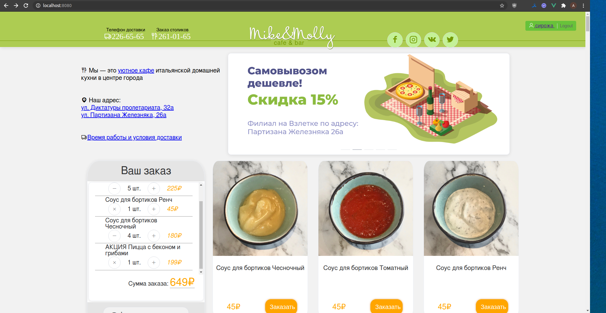
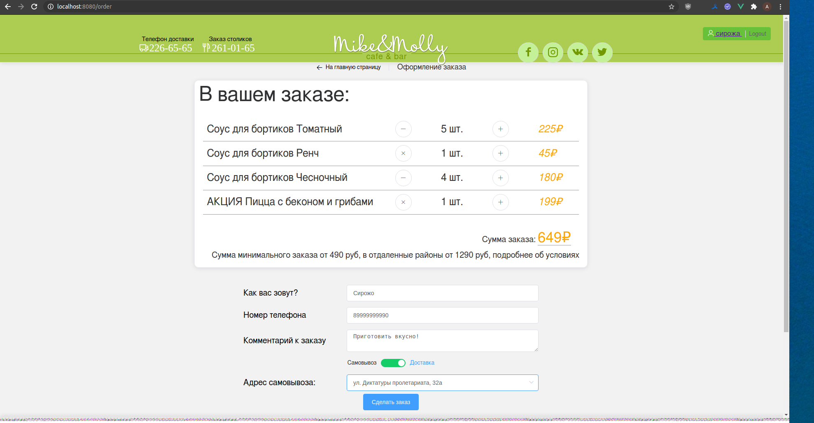

Проект на Django и Vue, для курсовой работы.  
Готов базовый функционал службы доставки еды.  
Дизайн частично подсмотрен на действующем сайте.

#### Доработать:
- Валидация полей заказа( vuelidate  )
- Разграничить права доступа
- Анимации?
- Выпадающее меню для маленького разрешения
- Создать второстепенные страницы
- Обратить внимание на шрифты
- Написать тесты
- Логирование
- Найти информацию про кастомизацию админки

#### Запуск
Для запуска docker без sudo (для локалки)

`sudo groupadd docker`

`sudo gpasswd -a ${USER} docker`

`newgrp docker`

`sudo service docker restart`

Для запуска docker-compose без sudo (для локалки)  
`sudo ln -s /usr/local/bin/docker-compose /usr/bin/docker-compose`

Установка Fabric для удобной работы  
`sudo pip install Fabric3`

Запуск приложения  
`docker-compose build` - сборка

`fab dev` - запуск

`fab migrate` - применить миграции  
`fab createsuperuser` - создать супер пользователя  
#### Главная страница от 07.09:
​
#### Cтраница оформления заказа от 07.09:
​
